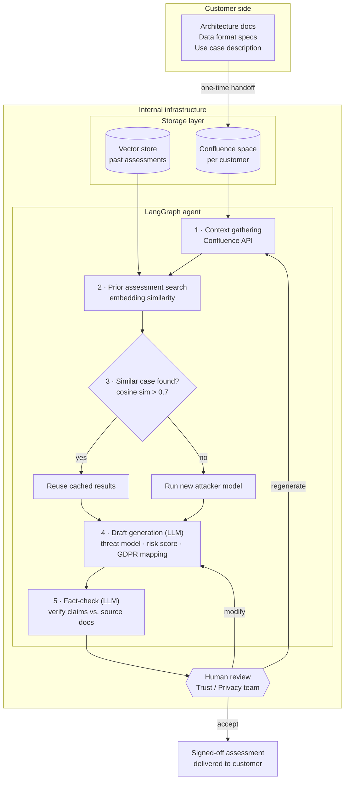

# Agentic Privacy Assessment Pipeline

An agentic LLM workflow that automates customer data-sharing privacy assessments — replacing a multi-day manual review process with a retrieval-grounded, human-reviewed pipeline that runs in hours.

**Impact:** cut assessment turnaround from ~1 week to under half a day (~90% reduction) across enterprise engagements in automotive, insurance, and industrial mobility.

---

## The problem

Every new enterprise data-sharing engagement required a manual, multi-step review:

1. Review the customer's data schema and probe format
2. Cross-reference against anonymization algorithm capabilities
3. Evaluate privacy risk using attacker-model results
4. Draft a data-sharing assessment document
5. Get compliance sign-off

This is a multi-step reasoning task over structured documents and prior precedent — a natural fit for an agentic workflow, **not** a fully autonomous one. Every output is still verified by a human before it reaches a customer.

## The trust boundary

The core design constraint: the customer never gets access to internal systems. They hand over documents once; everything downstream runs entirely inside our own infrastructure.

| What | Where it lives | How the agent accesses it |
|---|---|---|
| Customer's docs | Internal Confluence (customer-provided) | Confluence API (structured) |
| Prior assessments | Internal vector store | Embedding similarity search |
| Attacker model | Internal service | Internal API call |
| LLM | External API | LangChain wrapper |
| Human reviewer | Internal Trust/Privacy team | Manual approval step |

## Architecture



## How it works

1. **Context gathering** — the agent pulls the customer's architecture docs and data specs from an internal Confluence space (never from the customer's own systems).
2. **Prior assessment search** — the current use case is embedded and matched against a vector store of past assessments; a high similarity score lets the agent reuse prior analysis instead of starting from scratch.
3. **Attacker-model decision** — if no close precedent exists, the pipeline triggers a full attacker-model run to quantify re-identification risk for this specific data configuration.
4. **Draft generation** — an LLM call produces a structured draft: threat model, quantified risk, configuration recommendation, and regulatory (GDPR) mapping.
5. **Fact-check pass** — a *separate* LLM call cross-checks every claim in the draft against the source documents and flags low-confidence sections rather than letting them pass silently.
6. **Human review** — the Trust/Privacy team accepts, edits, or requests a regeneration. Edits are fed back as examples to improve future drafts.

## Why a separate fact-check step matters

The riskiest failure mode for an LLM-in-the-loop compliance workflow isn't a bad draft — it's a *confident, wrong* draft that a reviewer rubber-stamps. Splitting generation and verification into separate LLM calls, and routing every output through a human reviewer before it reaches a customer, keeps the system firmly in the "draft assistant" category rather than an autonomous decision-maker.

## Code sample: prior-assessment retrieval

[`vector_store.py`](./vector_store.py) implements step 2/3 of the pipeline above — embedding a new use case, searching past assessments, and deciding whether to reuse a prior result or trigger a fresh attacker-model run.

A few deliberate choices worth noting:

- **No FAISS dependency.** At this corpus size (dozens to low hundreds of assessments), brute-force cosine similarity over an in-memory matrix is simpler, easier to test, and has zero index-build overhead. The `Embedder` interface is narrow enough to swap in FAISS or a managed vector DB later without touching calling code, if the corpus ever grows enough to justify it.
- **Graceful embedding fallback.** The module prefers a local `sentence-transformers` model but falls back to a dependency-free hashing embedder if that package isn't installed — so the file runs end-to-end with zero setup for anyone cloning the repo.
- **Tested.** See [`test_vector_store.py`](./test_vector_store.py) — 7 tests covering embedding normalization, similarity ranking, and the reuse-threshold decision logic.

```bash
pip install -r requirements.txt
python vector_store.py          # runs the demo against synthetic use cases
python -m pytest test_vector_store.py -v
```

## Code sample: Confluence context gathering

[`confluence_client.py`](./confluence_client.py) implements step 1 — pulling a customer's architecture docs and data specs out of their dedicated internal Confluence space and normalizing them into plain text for the LLM context window.

A few deliberate choices worth noting:

- **Read-only, on purpose.** The client only ever GETs content — no create/edit/delete methods exist, since the pipeline consumes customer docs, it never modifies the source of truth.
- **Credentials never hardcoded.** Auth comes from environment variables (`CONFLUENCE_BASE_URL`, `CONFLUENCE_EMAIL`, `CONFLUENCE_API_TOKEN`), matching how Atlassian Cloud's REST API expects HTTP Basic Auth with an email + API token.
- **Handles the two most common real-world gotchas:** pagination (Confluence list endpoints page results) and 429 rate-limiting with `Retry-After` backoff.
- **Fully offline test suite.** [`test_confluence_client.py`](./test_confluence_client.py) mocks the HTTP layer entirely — 7 tests covering markup stripping, pagination, auth failures, rate-limit retries, and the unknown-space error path. No real Confluence instance or credentials needed to run it.

```bash
export CONFLUENCE_BASE_URL="https://your-domain.atlassian.net"
export CONFLUENCE_EMAIL="pipeline-bot@your-domain.com"
export CONFLUENCE_API_TOKEN="..."
python confluence_client.py             # live demo, requires real credentials above
python -m pytest test_confluence_client.py -v   # fully offline, no credentials needed
```

## Code sample: attacker model (privacy risk evaluation)

[`attacker_model.py`](./attacker_model.py) implements the "attacker model / internal service" step — the tool that stress-tests an anonymization technique *before* it ships, by trying to break it.

**This operates entirely on synthetically generated data.** No real individuals, devices, or location datasets are used or represented anywhere in this module.

The pipeline it models:

1. **Synthetic population generation** — individuals with distinct home/work locations and realistic hourly commute patterns.
2. **Spatial anonymization** — GPS points are snapped to a coarser grid cell; larger cells mean stronger anonymization and less precision.
3. **DAG-based reconstruction** — since a coarse cell hides *where* within it someone actually was, the attacker builds a small graph of candidate fine-grained positions per timestep and finds the most physically plausible path through it via dynamic programming, bounded by a max-speed constraint.
4. **Feature extraction** — inferred home/work centroids plus a visited-cell histogram, the same signal a real linkage attack relies on.
5. **A gradient-boosted classifier** (XGBoost if installed, scikit-learn otherwise) trained on a labeled background population attempts to link each anonymized trajectory back to its true identity. Re-identification accuracy is the risk metric.

Running the demo reproduces the shape of the real privacy/utility tradeoff — stronger anonymization drives re-identification accuracy down, at the cost of data precision:

```
 cell_size |  re-id accuracy
------------------------------
         2 |          87.5%
        10 |          86.7%
        25 |          37.5%
        50 |          15.0%
        80 |          10.8%
```

```bash
python attacker_model.py                    # prints the risk curve above
python -m pytest test_attacker_model.py -v  # 10 tests, incl. "stronger anonymization -> lower risk"
```

## Code sample: draft generation (LLM)

[`draft_generator.py`](./draft_generator.py) implements step 4 — turning gathered context (customer docs, a similar prior assessment if one was found, and the attacker model's risk score) into a structured draft: threat model, configuration recommendation, and a GDPR mapping.

**The one design decision worth reading closely:** the risk **level** (low/medium/high) is computed deterministically in code from the attacker model's numeric score (`classify_risk_level`) — it is never parsed from the LLM's response, even if the LLM's output happens to include one. A compliance document's risk tier shouldn't depend on generative interpretation of a number that was already computed precisely upstream. The LLM's role is limited to the narrative sections; a test (`test_risk_level_is_not_taken_from_llm_even_if_it_tries_to_supply_one`) explicitly locks this in.

Other choices:

- **Structured JSON output, strictly validated.** The system prompt requests exactly three keys; a missing key or invalid JSON raises `DraftGenerationError` rather than silently producing a malformed draft.
- **The prompt explicitly tells the model not to invent facts** not present in the provided context — the same "don't fill gaps confidently" instinct that motivates the separate fact-check step later in the pipeline.
- **Zero-dependency mock LLM client** for demos and tests, following the same fallback pattern as the other modules — no API key required to run the demo or test suite.

```bash
python draft_generator.py                    # runs with the mock client, no API key needed
python -m pytest test_draft_generator.py -v  # 12 tests, fully offline
```

## Integration test: the full pipeline, wired together

[`pipeline.py`](./pipeline.py) is the orchestrator that composes all four modules above into the actual call sequence from the architecture diagram — context gathering, then either reusing a prior assessment or running a fresh attacker-model evaluation, then draft generation.

[`test_pipeline_integration.py`](./test_pipeline_integration.py) exercises this end-to-end, fully offline (mocked Confluence, hashing embedder, a small synthetic attacker-model population, mock LLM). It specifically proves the two behaviors that matter most about this design:

- **When no similar prior assessment exists**, the attacker model actually runs, and the resulting draft's risk level is consistent with the score it produced.
- **When a sufficiently similar prior assessment exists**, the attacker model is *skipped entirely* — verified by call-counting, not just by checking the final output — and the cached risk score flows through to the draft instead.

This is the test that would catch the most expensive class of bug in this pipeline: quietly re-running (or quietly skipping) an attacker-model evaluation when the routing logic should have done the opposite.

```bash
python -m pytest test_pipeline_integration.py -v   # 3 tests, fully offline
python -m pytest -v                                 # run everything — 49 tests across the repo
```

## Code sample: a real agent (not just an LLM-orchestrated workflow)

Worth being precise about a distinction that matters: [`pipeline.py`](./pipeline.py) above is an **LLM-orchestrated workflow** — the code decides which module to call and in what order; the LLM only generates text within a step. [`agent.py`](./agent.py) is a genuine **agent** — the LLM is given a set of tools and decides for itself which to call, when, and when it has enough information to submit a final answer. The control flow lives in the model's output, not in an `if/else` statement.

Implemented directly against Anthropic's tool-use API rather than through LangGraph/LangChain — a from-scratch loop is a stronger demonstration of what those frameworks are actually doing underneath (a graph engine's tool-calling node is this same loop with more scaffolding around it).

**Tool design, worth reading closely:**

- `search_confluence_docs`, `search_prior_assessments`, and `run_attacker_model` are read-only information-gathering tools. `run_attacker_model`'s description explicitly flags it as expensive and tells the agent to check for a reusable prior assessment first — but nothing *forces* that order. `test_agent.py` proves the agent actually respects it, by call-counting whether the (mocked) attacker model runs.
- `submit_privacy_assessment` doubles as the "final answer" tool — calling it ends the loop. Its schema **does not include a `risk_level` field**, only `risk_score`. This is a stronger version of the guarantee `draft_generator.py` enforces at the code level: instead of stripping an unwanted field after the fact, the tool schema never gives the model the option to supply one in the first place. `risk_level` is always computed by `classify_risk_level`.
- The agent loop has a hard `max_iterations` cap and raises `AgentError` rather than looping forever if the model never calls a tool or never submits — a real failure mode for any tool-calling loop, tested explicitly.

```bash
python agent.py                    # runs with the scripted mock client, no API key needed
python -m pytest test_agent.py -v  # 10 tests, incl. both branch outcomes and both failure modes
```


`LangGraph` · `LangChain` · Confluence API · Vector similarity search · LLM (GPT-family) · Human-in-the-loop review

---

*This is a sanitized architecture overview of a production system. Customer names, internal infrastructure details, and exact configuration values have been generalized or removed.*
